# CherryOS——操作系统课程设计文档

* [<strong>1.</strong> 项目概述](#1-项目概述)
   * [<strong>1.1</strong> 项目简介](#11-项目简介)
   * [<strong>1.2</strong> 项目配置](#12-项目配置)
   * [<strong>1.3</strong> 项目分工](#13-项目分工)
* [2. 如何运行项目](#2-如何运行项目)
   * [2.1 安装Bochs](#21-安装bochs)
   * [2.2 安装NASM](#22-安装nasm)
   * [2.3 修改工作路径](#23-修改工作路径)
   * [2.4 运行cherryOS](#24-运行cherryos)
* [3. 操作说明](#3-操作说明)
   * [3.1 开机动画](#31-开机动画)
   * [3.2 主界面](#32-主界面)
   * [3.3 帮助界面：](#33-帮助界面)
      * [无该指令](#无该指令)
      * [man help](#man-help)
      * [man clear](#man-clear)
      * [man man](#man-man)
      * [man math](#man-math)
      * [man cal](#man-cal)
      * [man process](#man-process)
      * [man file](#man-file)
   * [3.4 系统级应用—进程管理](#34-系统级应用进程管理)
      * [主页](#主页)
      * [ps](#ps)
      * [kill [id]](#kill-id)
         * [不可结束：](#不可结束)
         * [id非法：](#id非法)
         * [成功执行：](#成功执行)
      * [restart [id]](#restart-id)
         * [成功执行：](#成功执行-1)
         * [正在运行：](#正在运行)
         * [id非法：](#id非法-1)
   * [3.5 系统级应用—文件管理](#35-系统级应用文件管理)
      * [主页](#主页-1)
      * [创建文本文件](#创建文本文件)
      * [创建文件夹](#创建文件夹)
      * [显示本目录级别的文件目录](#显示本目录级别的文件目录)
      * [打开文件夹](#打开文件夹)
      * [回退上一级文件](#回退上一级文件)
      * [打开文本文件](#打开文本文件)
         * [查看和退出（上图）	编辑和保存（下图）](#查看和退出上图编辑和保存下图)
      * [删除文件](#删除文件)
      * [文件保存](#文件保存)
   * [3.6 用户级应用**—计算器**](#36-用户级应用计算器)
      * [计算表达式的值 math [expression]](#计算表达式的值-math-expression)
      * [对表达式进行美化 math -beauty [expression]](#对表达式进行美化-math--beauty-expression)
      * [将中缀表达式转换为后缀表达式 math -rev [expression]](#将中缀表达式转换为后缀表达式-math--rev-expression)
      * [表达式中含有非法字符](#表达式中含有非法字符)
      * [表达式括号不匹配](#表达式括号不匹配)
   * [3.7 用户级应用—日历](#37-用户级应用日历)
      * [显示某月月历](#显示某月月历)
      * [计算某一天是周几](#计算某一天是周几)
      * [计算某一天是该年的第几天](#计算某一天是该年的第几天)
      * [年份检测](#年份检测)
      * [月份检测](#月份检测)
      * [日期检测](#日期检测)
      * [平年二月份检测](#平年二月份检测)
      * [闰年二月份检测](#闰年二月份检测)
   * [3.8 用户级应用—2048](#38-用户级应用2048)
   * [3.9 用户级应用—推箱子](#39-用户级应用推箱子)
   * [3.10 用户级应用—井字棋](#310-用户级应用井字棋)
   * [3.11 用户级应用—五子棋](#311-用户级应用五子棋)
   * [3.12 用户级应用—扫雷](#312-用户级应用扫雷)
* [4. 功能实现](#4-功能实现)
   * [4.1 用户级应用—日历](#41-用户级应用日历)
   * [4.2 用户级应用—计算器](#42-用户级应用计算器)
   * [4.3 用户级应用—2048](#43-用户级应用2048)
   * [4.4 用户级应用—扫雷](#44-用户级应用扫雷)
   * [4.5 用户级应用—井字棋](#45-用户级应用井字棋)
   * [4.6 用户级应用—五子棋](#46-用户级应用五子棋)
   * [4.7 用户级应用—推箱子](#47-用户级应用推箱子)
   * [4.8 系统级应用—进程管理](#48-系统级应用进程管理)
   * [4.9 系统级应用—文件管理](#49-系统级应用文件管理)
-----

## **1.** 项目概述

### **1.1** 项目简介

​	本项目以 Oranges’操作系统作为基本框架，完成了 3 个系统级应用: 多功能控制台、进程管理和文件管理。同时，还实现了 7 个用户级应用，包括计算器，日历和 5 个小游戏（2048，推箱子，井字棋，五子棋，扫雷）。系统将根据输入的命令进行不同的操作。

​	额外的，项目还有许多附加的小功能，例如开机动画（逐帧动画），清屏等。

### **1.2** 项目配置

​	编写语言：汇编语言，C语言

​	开发环境：Linux系统下的Bochs 2.6.9

​	运行环境：windows上的VMWare

### **1.3** 项目分工

​	张喆：框架搭建、文件管理、计算器、日历

​	卜滴：推箱子、井字棋、五子棋、扫雷

​	刘一默：进程管理、日历、2048、五子棋


## 2. 如何运行项目

### 2.1 安装Bochs

- 安装插件

  ```bash
  sudo apt-get install build-essential
  sudo apt-get install xorg-dev
  sudo apt-get install bison
  sudo apt-get install libgtk2.0-dev
  ```

- 安装Bochs

  - 下载`bochs-2.x.x.tar.gz`包

  - 进入到`bochs-2.x.x.tar.gz`的上级目录

    ```bash
    tar -axvf bochs-2.x.x.tar.gz
    cd bochs-2.x.x.tar.gz
    ./configure --enable-debugger --enable-disasm
    ```

  - 打开Makefile, 找到92行左右的LIBS=..., 在行尾添加-lpthread

    ```bash
    make
    sudo make install
    ```

### 2.2 安装NASM

- 下载`nasm-x.x.x.tar.gz`包

- 进入到`nasm-x.x.x.tar.gz`的上级目录

  ```bash
  cd nasm-x.x.x.tar.gz
  ./configure
  make
  sudo make install
  ```

### 2.3 修改工作路径

- 进入到cherryOS目录中

- 修改`bochsrc`, 将如下三个路径更换为自己的工作路径

  

### 2.4 运行cherryOS

- 在`cherryOS/`中打开命令行

- 输入 `bochs` -> 6 -> c

  

- ***<u>这里放张系统主界面的截屏</u>***


## 3. 操作说明

​	打开终端，输入 bochs、回车、’c’ 进入调试模式。

### 3.1 开机动画 

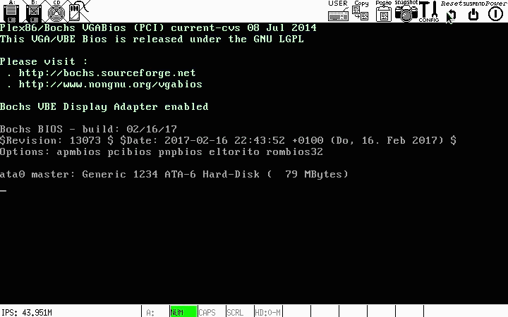

### 3.2 主界面

​	菜单显示系统提供的所有功能编号及概要。输入各命令或其编号，进入相应功能界面。

​	若想要回到主界面（help界面），在命令行中输入“help”按下回车即可。

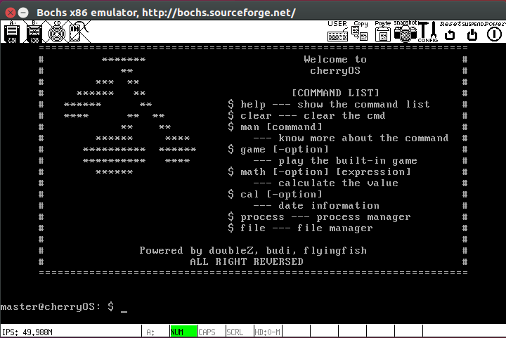

### 3.3 帮助界面：

​	在命令行中输入 man -XXX 即可进入相关的帮助界面，系统会对指令的功能进行具体的介绍。

#### 	无该指令

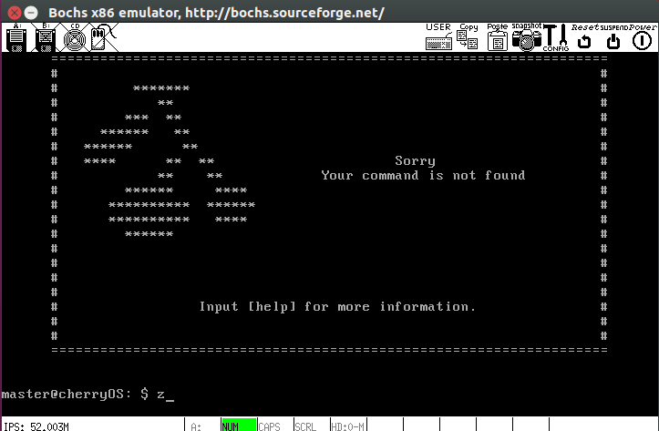

#### 	man help

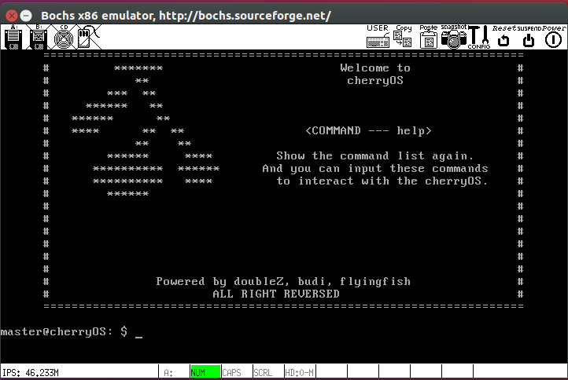

#### 	man clear

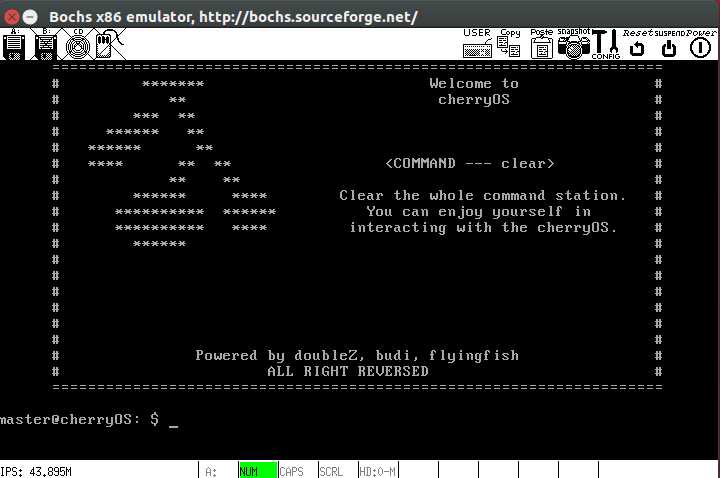

#### 	man man

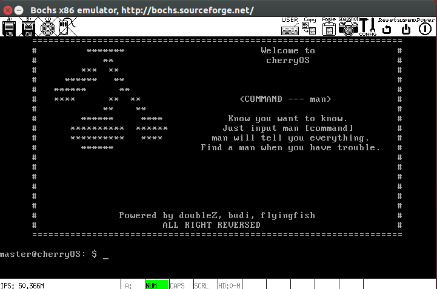

#### 	man math

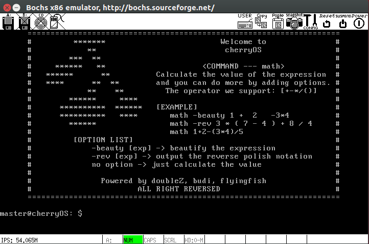

#### 	man cal


#### 	man process

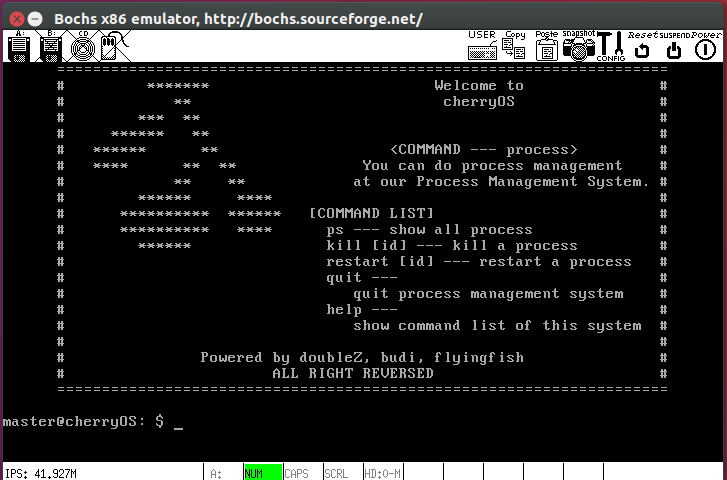

#### 	man file

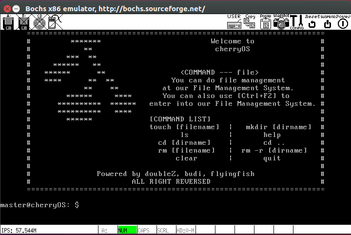

### 3.4 系统级应用—进程管理

​	在命令行中输入 process 即可进入进程管理。

#### 	主页

​		进程管理欢迎界面，并显示进程管理支持的所有指令以及它们的功能。

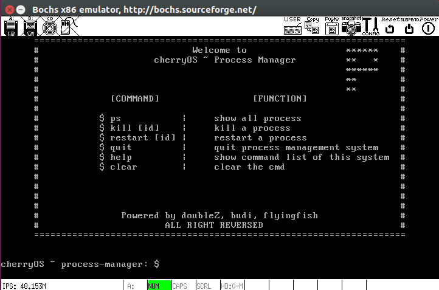

#### 	ps

​		输入 ps ，展示该系统当前所有进程的ID，进程名称，优先级以及是否正在运行。

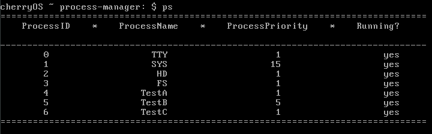

#### 	kill [id]

​		输入 kill [id]，即可结束目标进程。若目标进程不存在，id 非法或不可结束将弹出反馈信息。

##### 	不可结束：

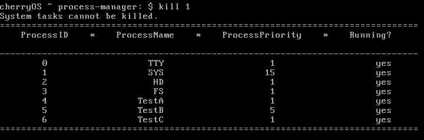

##### 	id非法：


##### 	成功执行：

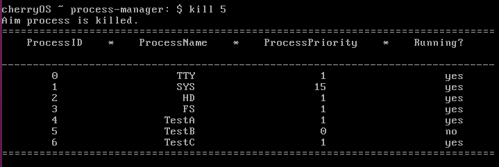

#### 	restart [id]

​		输入 restart [id]，即可启动未运行进程。若目标进程不存在，id 非法或目标进程已在运行，则弹出反馈信息。输入quit，即可退出进程管理系统。

##### 	成功执行：

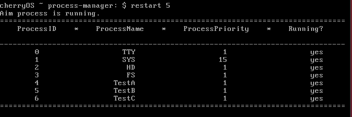

##### 	正在运行：


##### 	id非法：


### 3.5 系统级应用—文件管理

​	TestB：文件系统

​	该文件系统模拟linux的部分简单的文件操作，并设置初始用户为home。

​	该文件系统中文件保存在名为 ss 的“虚拟文件”里，该文件刻在 80.img 的“硬盘”里，所以可以进行长期的保存。

#### 	主页

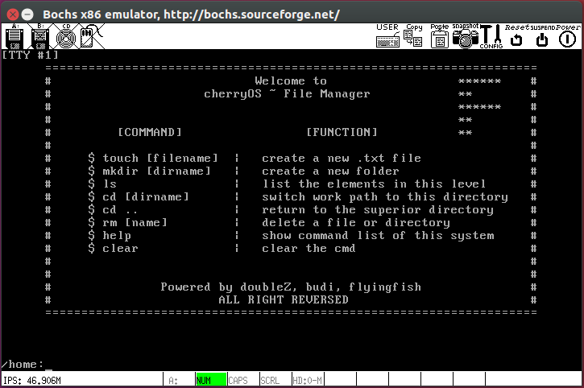

#### 	创建文本文件

​		输入 touch XXX 创建文件

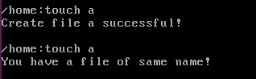

#### 	创建文件夹

​		输入 mkdir XXX 创建

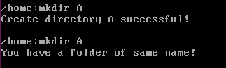

#### 	显示本目录级别的文件目录

​		后缀为 txt 代表文本文件，fd 代表文件夹类型文件。

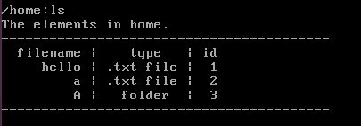

#### 	打开文件夹

​		输入 cd XXX 打开文件夹，进入下一级文件。

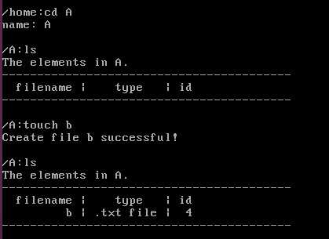

#### 	回退上一级文件

​		输入 cd ..

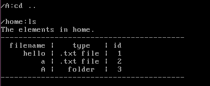

#### 	打开文本文件

​		可以进行三种操作：查看、编辑文本文件以及退出保存。

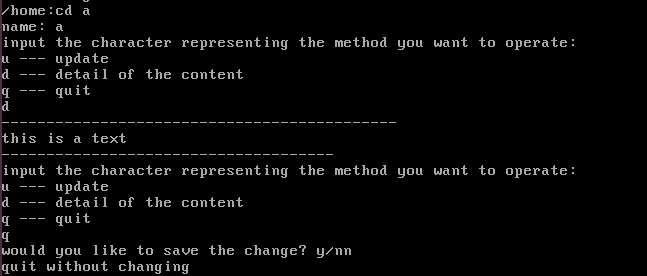

##### 				查看和退出（上图）	编辑和保存（下图）

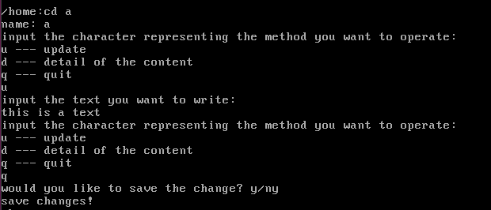

#### 	删除文件

​		rm XXX 删除文件

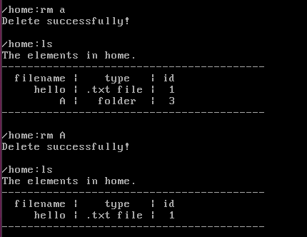

#### 	文件保存

​		输入 sv 保存内容，将更新过的文件信息保存进文件系统。


### 3.6 用户级应用**—计算器**

#### 	计算表达式的值 math [expression]

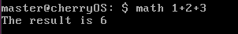

#### 	对表达式进行美化 math -beauty [expression]


#### 	将中缀表达式转换为后缀表达式 math -rev [expression]

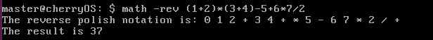

#### 	表达式中含有非法字符

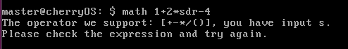

#### 	表达式括号不匹配

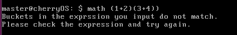

### 3.7 用户级应用—日历

​	本项目实现了日历功能，能够进行经典的日历操作，并对不符的输入进行检测与提示。

#### 	显示某月月历

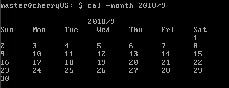

#### 	计算某一天是周几

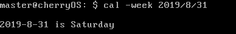

#### 	计算某一天是该年的第几天

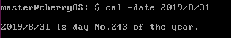

#### 	年份检测

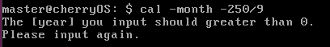

#### 	月份检测

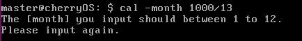

#### 	日期检测

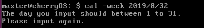

#### 	平年二月份检测

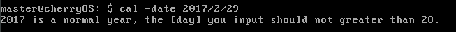

#### 	闰年二月份检测


### 3.8 用户级应用—2048

​	本项目实现了经典的2048小游戏，通过 wsad 进行上下左右移动的操作，并给出实时分数，并可通过 q 退出（quit）。

​	初始界面

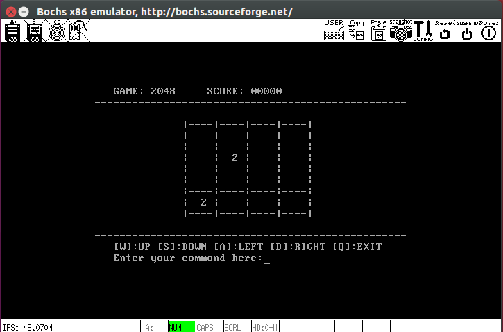

​	退出

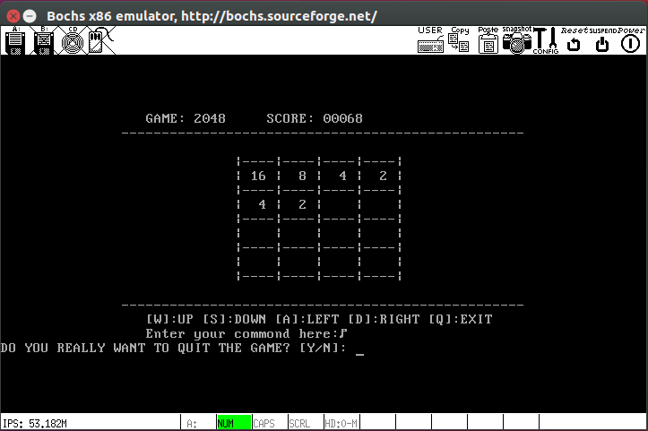

### 3.9 用户级应用—推箱子

​	本项目实现了经典的推箱子游戏功能。

​	初始界面

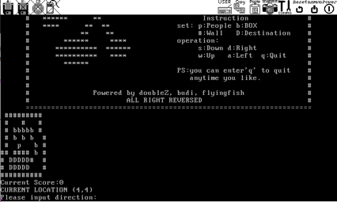

​	游戏界面

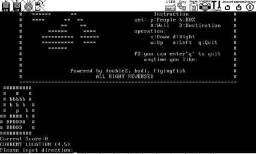

### 3.10 用户级应用—井字棋

​	本项目实现了经典的井字棋小游戏，支持人机对战，实现了系统AI。

​	初始界面

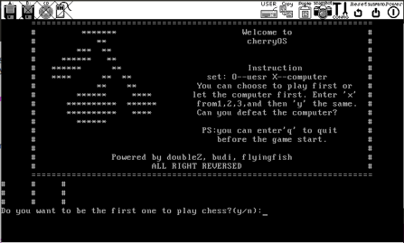

​	游戏界面

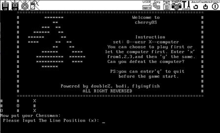

### 3.11 用户级应用—五子棋

​	本项目实现了经典的五子棋游戏功能。

​	初始界面	

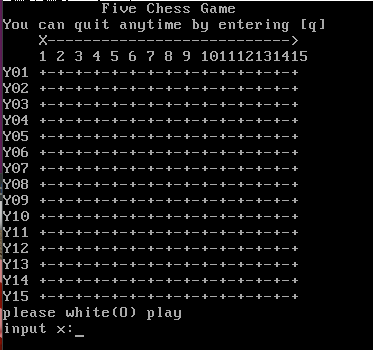

​	游戏界面

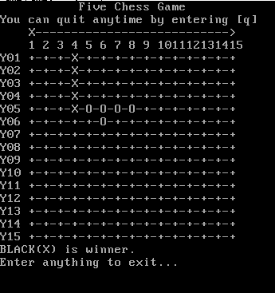

### 3.12 用户级应用—扫雷

​	本项目实现了经典的扫雷游戏功能。

​	初始界面

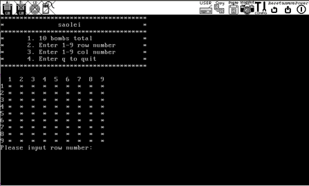

​	游戏界面


## 4. 功能实现

### 4.1 用户级应用—日历

主要函数

| 函数名称      | 返回值类型 | 函数参数                     | 作用                       |
| ------------- | ---------- | ---------------------------- | -------------------------- |
| Isleap        | int        | Int year                     | 判断概念是否为闰年         |
| Total_dat     | int        | Int year, int month, int day | 计算改日期是该年的第多少天 |
| Weekday       | int        | Int year, int month, int day | 判断该日期是周几           |
| display_month | void       | Int year, int month          | 显示该月日历               |

代码展示

```c
/*****************************************************************************
 *                                calendar
 *****************************************************************************/
int Isleap(int year);

/*判断输入年份二月份的天数
返回值:month的天数*/
int Max_day(int year, int month);

/*计算输入的日期是这一年的多少天*/
int Total_day(int year, int month, int day);

/*由输入的日期判断当天是星期几
**返回值:count,0～6，分别表示星期日～星期六
*/
int Weekday(int year, int month, int day);


/*显示输入的日期是星期几*/
void display_week(int year, int month, int day);

/*显示输入的日期的当月日历*/
void display_month(int year, int month);
```

### 4.2 用户级应用—计算器

​	主要函数

| 函数名称         | 返回值类型 | 函数参数                                          | 作用                     |
| ---------------- | ---------- | ------------------------------------------------- | ------------------------ |
| calculate        | int        | char* origin_exp, bool if_showrev, bool if_beauty | 计算主函数               |
| calResult        | int        | struct Data result[], int size                    | 计算后缀表达式           |
| check_exp_bucket | bool       | char* exp                                         | 判断表达式括号是否匹配   |
| check_exp_notion | bool       | char* exp                                         | 判断表达式是否有非法符号 |

​	代码展示 

```c
/*****************************************************************************
 *                                计算器
 *****************************************************************************/

typedef int bool;
typedef int DATA;
#define False 0
#define True 1
#define EMPTY_CH '\0'
#define EMPTY_NUM -999999
#define SIZE 50


/*============ 操作数栈 ============*/
int num_stack[100] = { 0 };
int num_stack_index = -1;

bool isempty_num_stack();

void num_stack_push(int num);

int num_stack_pop(void);

void num_stack_clear(void);

/*============ 优先级 ============*/
int isp(char ch);
//栈内优先级
int icp(char ch);
//栈外优先级


/*============ 运算符判断 ============*/
bool isOperator(char c);

/*============ 单个数字字符判断 ============*/
bool isDigit(char ch);

/*============ 数字判断 ============*/
bool isNum(char* exp);
//数字包括 正数 负数 浮点数 (其中+3要进行特殊处理)


/*============ 在表达式最后添加 # 标识符 ============*/
void addTail(char* exp);

/*============ 封装表达式中的项 ============*/
struct Data {
	int data;	//数据本身
	int flag;	//0->char, 1->int
};
int _current = 0;

/*============ 获取表达式中的下一项 ============*/
struct Data NextContent(char* exp);


/*============ 根据运算符和两个操作数计算值 ============*/
int Cal(int left, char op, int right);

/*============ 输出后缀表达式 ============*/
void showBackMode(struct Data result[], int size);

/*============ 计算后缀表达式的结果 ============*/
int calResult(struct Data result[], int size);


/*============ 顶层计算函数 ============*/
int calculate(char* origin_exp, bool if_showrev, bool if_beauty) ;

/*判断表达式括号是否匹配*/
bool check_exp_bucket(char* exp);

/*判断表达式是否有非法符号*/
bool check_exp_notion(char* exp);
```

### 4.3 用户级应用—2048

​	主要函数

| 函数名称        | 返回值类型 | 函数参数                    | 作用                   |
| --------------- | ---------- | --------------------------- | ---------------------- |
| Run2048         | void       | int fd_stdin, int fd_stdout | 程序入口               |
| loop_game       | void       | int fd_stdin                | 循环的游戏输入输出逻辑 |
| reset_game      | void       | null                        | 重置游戏               |
| add_rand_num    | void       | null                        | 生成并加入一个随机数   |
| check_game_over | void       | null                        | 检查游戏是否结束       |
| move_left       | void       | null                        | 左移                   |
| move_right      | void       | null                        | 右移                   |
| move_up         | void       | null                        | 上移                   |
| move_down       | void       | null                        | 下移                   |
| refresh_show    | void       | null                        | 刷新界面               |

​	代码展示

```c
/*****************************************************************************
 *                                2048
 *****************************************************************************/

#define KEY_CODE_UP    0x41
#define KEY_CODE_DOWN  0x42
#define KEY_CODE_LEFT  0x44
#define KEY_CODE_RIGHT 0x43
#define KEY_CODE_QUIT  0x71

struct termios old_config; /* linux下终端属性配置备份 */


static char config_path[4096] = { 0 }; /* 配置文件路径 */

static void init_game();    /* 初始化游戏 */
static void loop_game(int fd_stdin);    /* 游戏循环 */
static void reset_game();   /* 重置游戏 */
static void release_game(int signal); /* 释放游戏 */

static char* read_keyboard(int fd_stdin);

static void move_left();  /* 左移 */
static void move_right(); /* 右移 */
static void move_up();    /* 上移 */
static void move_down();  /* 下移 */

static void add_rand_num();    /* 生成随机数，本程序中仅生成2或4，概率之比设为9:1 */
static void check_game_over(); /* 检测是否输掉游戏，设定游戏结束标志 */
static int get_null_count();   /* 获取游戏面板上空位置数量 */
static void clear_screen();    /* 清屏 */
static void refresh_show();    /* 刷新界面显示 */

static int board[4][4];     /* 游戏数字面板，抽象为二维数组 */
static int score;           /* 游戏得分 */
static int best;            /* 游戏最高分 */
static int if_need_add_num; /* 是否需要生成随机数标志，1表示需要，0表示不需要 */
static int if_game_over;    /* 是否游戏结束标志，1表示游戏结束，0表示正常 */
static int if_prepare_exit; /* 是否准备退出游戏，1表示是，0表示否 */
```

### 4.4 用户级应用—扫雷

​	主要函数

| 函数名称    | 返回值类型 | 函数参数                    | 作用               |
| ----------- | ---------- | --------------------------- | ------------------ |
| sl_init     | void       | int fd_stdin, int fd_stdout | 初始化游戏         |
| sl_set_mine | void       | int fd_stdin                | 埋地雷             |
| sl_display  | void       | null                        | 打印地图           |
| sl_get_num  | int        | int x, int y                | 计算某个位置的数字 |
| sl_sweep    | int        | null                        | 展开地图           |
| runMine     | int        | int fd_stdin, int fd_stdout | 程序入口           |

​	代码展示

```c
/*======================================================================*
										mine
 *======================================================================*/

#define rows 11
#define cols 11
#define Count 10

char mine[rows][cols];
char show[rows][cols];

void sl_init();

void sl_set_mine();

void sl_display(char a[rows][cols]);

int sl_get_num(int x, int y);
  
int sl_sweep();

int runMine(fd_stdin, fd_stdout);
```

### 4.5 用户级应用—井字棋

​	主要函数

| 函数名称        | 返回值类型 | 函数参数                    | 作用       |
| --------------- | ---------- | --------------------------- | ---------- |
| Printchessboard | void       | null                        | 打印棋盘   |
| IsWin           | int        | struct State s              | 判断输赢   |
| e_fun           | int        | struct State s              | 评估函数   |
| AutoDone        | int        | null                        | 计算机落子 |
| UserInput       | int        | int fd_stdin, int fd_stdout | 用户落子   |
| TicTacToe       | int        | int fd_stdin, int fd_stdout | 程序入口   |

​	代码展示

```c
/*======================================================================*
										TicTacToe
 *======================================================================*/
int tmpQP[3][3]; //定义棋盘，0为空，1为敌方棋子，-1为我方棋子
#define MAX_NUM 1000
const int NO_BLANK = -1001;
const int TREE_DEPTH = 3; //搜索树的最大深度
const int NIL = 1001;    //空
static int s_count;


struct State//棋盘状态
{
	int QP[3][3];
	int e_fun; //评估函数值
	int child[9];
	int parent;
	int bestChild;
}States[MAX_NUM];


void chessMenu();

void Init();//初始化

void Printchessboard(); //打印棋盘

int IsWin(struct State s); //判断输赢

int e_fun(struct State s); //评估函数

int AutoDone(); //计算机决定落子位置，并判断当前棋局。

void UserInput(int fd_stdin, int fd_stdout); //用户输入落子位置

void TicTacToe(int fd_stdin, int fd_stdout);
```

### 4.6 用户级应用—五子棋

​	主要函数

| 函数名称   | 返回值类型 | 函数参数                       | 作用                     |
| ---------- | ---------- | ------------------------------ | ------------------------ |
| fiveChess  | int        | int fd_stdin                   | 程序入口                 |
| horizontal | int        | int row, int col, char whoFlag | 在横向上评估某位置的分数 |
| vertical   | int        | int row, int col, char whoFlag | 在纵向上评估某位置的分数 |
| leftSlope  | int        | int row, int col, char whoFlag | 在左斜上评估某位置的分数 |
| rightSlope | int        | int row, int col, char whoFlag | 在右斜上评估某位置的分数 |
| pcLoad     | void       | null                           | 计算机落子               |
| playerLoad | int        | Int fe_stdin                   | 用户落子                 |
| Win        | int        | null                           | 判断某方是否胜利         |

​	代码展示

```c
/*****************************************************************************
 *                               five chess
 *****************************************************************************/
#define WIDTH 15
#define HIGHT 15
#define WHITE 0
#define BLACK 1
#define WIN 2

char WHITE_FLAG = 'O';//大写o
char BLACK_FLAG = 'X';

char map[WIDTH][HIGHT];
int situationPC[WIDTH][HIGHT] = { 0 };  //situation
int situationPlayer[WIDTH][HIGHT] = { 0 };

int player = BLACK;

void init_map();
void draw_pc_map();
void draw_player_map();
void draw_map_chess();
int horizontal(int row, int col, char whoFlag);
int vertical(int row, int col, char whoFlag);
int leftSlope(int row, int col, char whoFlag);
int rightSlope(int row, int col, char whoFlag);
int result(int left, int right, int count, int k, char num);
void pcLoad();
void benefit();
int playerLoad(fd_stdin);
int win();
int fiveChess(fd_stdin);

```

### 4.7 用户级应用—推箱子

​	主要函数

| 函数名称   | 返回值类型 | 函数参数                    | 作用     |
| ---------- | ---------- | --------------------------- | -------- |
| Runpushbox | void       | int fd_stdin, int fd_stdout | 程序入口 |
| draw_map   | void       | Int map[9][11]              | 打印地图 |
| boxMenu    | void       | Null                        | 打印菜单 |

​	代码展示

```c
/*++++++++++++++++++++++++++++++++++++++++++++++++++++++++++++++++++++
																 push box
++++++++++++++++++++++++++++++++++++++++++++++++++++++++++++++++++++*/

int pi = 0;
int pj = 0;
void draw_map(int map[9][11]);

void boxMenu();

void Runpushbox(fd_stdin, fd_stdout);
```

### 4.8 系统级应用—进程管理

​	主要功能

​	该进程管理小工具主要包括进程状态的展示，以及进程的结束与重启 。

​	进程展示:该功能读取系统进程表 proc_table 表项以及其各个属性并打印到屏幕 

​	结束进程:该功能通过读取进程 ID 字符串，并将其换算为数值，以该数值做下表读取 系统进程表，修改目标表项 priority 与置 p_flags 属性值为-1 以达到结束进程目的。 

​	启动进程:该功能通过读取进程 ID 字符串，并将其换算为数值，以该数值做下表读取 系统进程表，恢复目标表项 priority 与置 p_flags 属性值为 1 以达到启动进程目的。 

​	代码展示

```c
/*****************************************************************************
 *                                processManager
 *****************************************************************************/ 
//进程管理主函数
void runProcessManage(int fd_stdin);
//打印欢迎界面
void showProcessWelcome();
//打印所有进程
void showProcess();
int getMag(int n);
//计算进程pid
int getPid(char str[]);
//结束进程
void killProcess(char str[]);
//重启进程
void restartProcess(char str[]);
```

### 4.9 系统级应用—文件管理

​	概述

​	该文件系统利用Oranges’代码样例中给出的open(),write()函数进行硬盘读写的模拟操作，将界面上各种文件控制操作和对应文件记录记录在80.img硬盘上。而该文件系统中文件类型分为文本文件以及文件夹类型的文件

​	主要函数

| 函数名称      | 返回值类型 | 函数参数                                 | 作用                               |
| ------------- | ---------- | ---------------------------------------- | ---------------------------------- |
| InitFiliBlock | void       | Int fileID, char* filename, int filetype | 初始话结构体                       |
| InttoStr3     | void       | char* temp, int I                        | 将Temp转化成对应的数，i代表数字    |
| WriteDisk     | void       | Int len                                  | 将文件结果存入硬盘                 |
| toInt         | int        | Char temp                                | 将temp数组对应数字转化为int值      |
| ReadDisk      | int        | void                                     | 读取硬盘内容                       |
| FSInt         | void       | void                                     | 初始化全局变量                     |
| CreateFile    | int        | char* filename, int filetype             | 根据文件类型创建文件，返回成功与否 |
| ShowFileList  | void       | void                                     | 展示这一级所有文件名               |
| SearchFile    | int        | char* name                               | 搜索该目录下特定文件名的文件       |
| ReturnFile    | void       | Int id                                   | 返回上一级文件夹ID                 |
| DeleteFile    | int        | Int id                                   | 删除特定ID的文件，返回成功与否的值 |
| ShowMessage   | void       | void                                     | 输出提示信息                       |

​	代码展示

```c
/*======================================================================*
							文件系统
 *======================================================================*/
#define MAX_FILE_PER_LAYER 10
#define MAX_FILE_NAME_LENGTH 20
#define MAX_CONTENT_ 50
#define MAX_FILE_NUM 100

 //文件ID计数器
int fileIDCount = 0;
int currentFileID = 0;

struct fileBlock {
	int fileID;
	char fileName[MAX_FILE_NAME_LENGTH];
	int fileType; //0 for txt, 1 for folder
	char content[MAX_CONTENT_];
	int fatherID;
	int children[MAX_FILE_PER_LAYER];
	int childrenNumber;
};
struct fileBlock blocks[MAX_FILE_NUM];
int IDLog[MAX_FILE_NUM];

//文件管理主函数
void runFileManage(int fd_stdin);

void initFileBlock(int fileID, char* fileName, int fileType);
void toStr3(char* temp, int i);
void WriteDisk(int len);
int toInt(char* temp);
int ReadDisk();
void FSInit();
int CreateFIle(char* fileName, int fileType);
void showFileList();
int SearchFile(char* name);
void ReturnFile(int ID);
void DeleteFile(int ID);
void ShowMessage();

```

